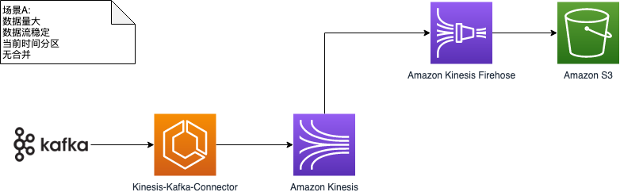
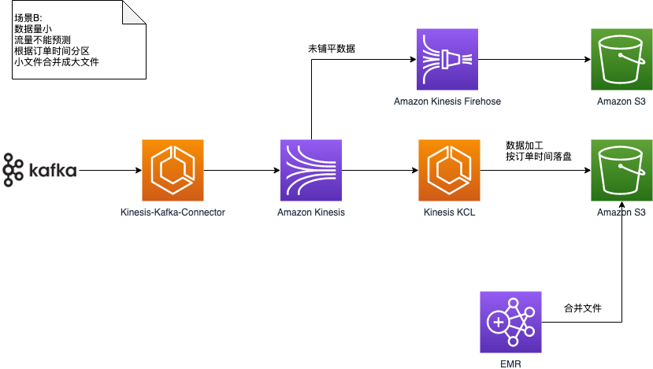

# 食亨大数据项目 PoC

如果发现暂时可以避开，但后续需要解决的问题，务必记录在 [Issues](https://github.com/JoeShi/shiheng/issues) 里面.

项目 PoC 期间，使用 [Kanban](https://github.com/JoeShi/shiheng/projects/1) 来追踪项目进度。

## 场景描述及架构图

### 场景A

* 数据量大；流量稳定
* 业务逻辑简单
* 根据落盘时间作为分区字段，不需要合并



### 场景B

先爬取最近90天的数据，通常是先不合并，然后计算一下，发现太慢，再人工触发合并，或者第二天进行合并。

* 数据量小
* 流量不可预测，可能是手动触发
* 根据订单时间落盘
* 如果发现查询慢，小文件合并成大文件；或者第二天触发合并
* 是否需要合并是配置选项




## TODO

- [ ] KCL 消费 Kinesis 的数据，铺平并根据订单时间落盘到 S3
- [ ] 通过 s3-dist-cp 将小文件合并成一个大文件
- [ ] Kinesis 原始数据通过 Firehose 落盘到 S3
- [ ] 然后通过 Spark 提取 S3 原始数据，根据订单时间落盘到 S3

## 开发资源共享

> p.s. 在没有任何特殊说明下都是运行在 /home/ec2-user 目录下

以下是 Kafka 集群和 Zookeeper 集群的共享信息
```
Kafka_List = 172.31.7.21:9092,172.31.31.118:9092,172.31.40.206:9092
Zookeeper_List = 172.31.8.225:2181,172.31.18.253:2181,172.31.47.133:2181
```

**创建 topic**
```shell script
./confluent-5.3.1/bin/kafka-topics --zookeeper 172.31.8.225:2181,172.31.18.253:2181,172.31.47.133:2181 --create --partitions 3 --replication-factor 2 --topic topicName 
```

**消费 topic**
```shell script
./confluent-5.3.1/bin/kafka-console-consumer --bootstrap-server 172.31.7.21:9092,172.31.31.118:9092,172.31.40.206:9092 --topic topicName
```

**手动打数据**
```shell script
./confluent-5.3.1/bin/kafka-console-producer --broker-list 172.31.7.21:9092,172.31.31.118:9092,172.31.40.206:9092 --topic topicName
```

## 如何使用 Kafka-connect-datagen 产生模拟数据

**AMI: ami-04eabc4c894294eb7**

[Kafka-connect-datagen](https://github.com/confluentinc/kafka-connect-datagen) 是 Kafka 的一个 connector, 
可以用来产生模拟数据。

`worker.properties` 和 `orders.properties` 已经配置好。Order 的格式请参考[orders_schema.avro](orders_schema.avro), 
里面有一个嵌套 JSON, 需要在后续做铺平操作. 默认情况下会打入 **orders** topic.


执行以下脚本即可
```shell script
./confluent-5.3.1/bin/connect-standalone worker.properties orders.properties
```

## 如何使用 Kinesis-kafka-connector 将数据注入 Kinesis

**AMI: ami-056bad4b853478d85**

[Kinesis-kafka-connector](https://github.com/awslabs/kinesis-kafka-connector) 可以用来将 Kafka 的数据打入到 Kinesis 中。

`worker.properties` 和 `kinesis.properties` 已经配置好。默认情况下会读取 **orders** topic，并打入叫 `shiheng-orders`。

执行以下脚本启动connect, **请务必使用 root 账号，`sudo su`**
```shell script
./confluent-5.3.1/bin/connect-standalone worker.properties kinesis.properties
```

## 编译 Kinesis-kafka-connector

操作系统：Amazon Linux 2

把已经编译好的 Jar 文件放入到 Confluent 中
```shell script
cp kinesis-kafka-connector/target/amazon-kinesis-kafka-connector-0.0.9-SNAPSHOT.jar ./confluent-5.3.1/share/java/kafka/
```

## 参考资料

https://github.com/confluentinc/avro-random-generator/blob/master/src/main/java/io/confluent/avro/random/generator/Generator.java


[Example AVRO schema file](https://github.com/confluentinc/kafka-connect-datagen/tree/master/src/main/resources)

