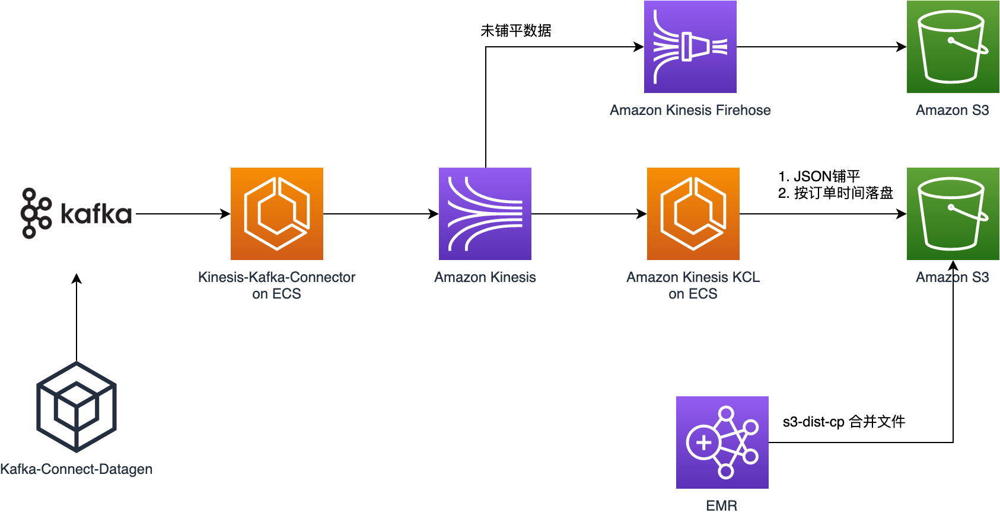
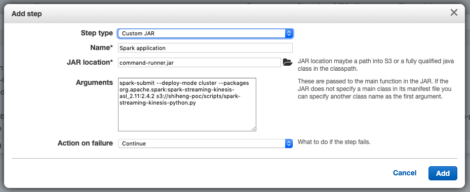

# 流式大数据数据分析 on AWS

如果发现暂时可以避开，但后续需要解决的问题，务必记录在 [Issues](https://github.com/JoeShi/shiheng/issues) 里面. 

在这个文章中，将分享将 Kafka 的数据注入到 Kinesis, 最后通过进行数据分析。在这个场景里，我们需要满足如下几个需求：

1. Kafka 的数据原格式进入 Kinesis, 方便后续将应用直接切到 Kinesis
1. Kinesis 中的数据在落盘前需要进行 ETL, 将 JSON 中的字段拉平，同时根据 JSON 中某个字段的值(例如：订单时间)进行分区
1. 太多的小文件不利于 HIVE 的查询，需要支持将小文件合并成大文件
1. (可选) 原始数据需要保留一份原文件
1. 方案需要高可用，易扩展

该方案在 AWS China Ningxia Region 进行过测试。

## TODO

- [x] 构建 Kafka 和 Zookeeper 集群
- [x] 构建 EMR 集群， HIVE metadata store 放置于 RDS Aurora
- [x] Kafka 数据利用 Kafka Kinesis Connector 原样注入 Kinesis
- [x] 利用 Kafka Datagen Connector 产生模拟数据打入 Kafka 集群 
- [x] KCL 消费 Kinesis 的数据，铺平并根据订单时间落盘到 S3
- [x] Sparking Streaming 消费 Kinesis 数据，铺平并根据订单时间落盘到 S3
- [ ] 优雅地退出一个 Spark Streaming 的任务
- [x] 通过 s3-dist-cp 将小文件合并成一个大文件
- [x] Kinesis 原始数据通过 Firehose 落盘到 S3，保留原始数据
- [x] Hive 创建表，分区
- [x] KCL 消费的时候，是否可以 rebalance
- [ ] EC2 IAM Role 消费 Kinesis, 产生 CloudWatch Metrics 的 Policy


## 架构图



结合该流式大数据分析的场景，我们给出架构方案，技术要点如下：
1. 使用 [awslabs/kinesis-kafka-connector](https://github.com/awslabs/kinesis-kafka-connector) 实现将数据
从 Kafka 搬迁到 Kinesis. 这个开源项目底层使用 [Kinesis Producer Library](https://docs.amazonaws.cn/en_us/streams/latest/dev/developing-producers-with-kpl.html) 
写入数据到 Kinesis, 同时通过 Kafka Connect 消费 Kafka 内的数据
1. 使用 [Kinesis Client Library](https://docs.amazonaws.cn/en_us/streams/latest/dev/developing-consumers-with-kcl-v2.html) 处理数据。
由于 Amazon Kinesis Firehose 不支持使用自定义字段进行分区，因此这里使用 KCL 进行数据的 ETL 和分区落盘
1. 使用 Amazon EMR 提供的 [s3-dist-cp](https://docs.aws.amazon.com/emr/latest/ReleaseGuide/UsingEMR_s3distcp.html) 命令行
工具，将小文件合并成大文件。 HIVE 在处理大量小文件的时候效率比较低，因此将文件合并能显著提供 HIVE 的查询效率
1. Firehose 将 Kinesis 中的原数据保存到 Amazon S3 中
1. 使用 [confluentinc/kafka-connect-datagen](https://github.com/confluentinc/kafka-connect-datagen) 产生模拟数据
插入 Kafka


## 准备环境

### Kafka 和 ZooKeeper 集群
为快速创建 kafka 集群，使用 [JoeShi/quickstart-kafka](https://github.com/JoeShi/quickstart-kafka) 在中国区 AWS 快速构建 Kafka
集群，您可使用现有的 Kafka 集群。

在搭建完集群后，我们可以从 Terraform 的输出中，得到以下关于集群的信息：
```shell script
# Kafka broker list
Kafka_List = 172.31.7.21:9092,172.31.31.118:9092,172.31.40.206:9092
# ZooKeeper list
Zookeeper_List = 172.31.8.225:2181,172.31.18.253:2181,172.31.47.133:2181
# S3 Access Role
S3_Connect_Worker_IAM_Role = S3-Connect-20191105014410665800000001
# Kafka access security group
Kafka_Access_Security_Group_Id = sg-0215d847878dc26af
```

`S3_Connect_Worker_IAM_Role` 是 IAM Role, 将这个 IAM Role 绑定到 EC2 即可访问 S3; 将 `Kafka_Access_Security_Group_Id` 安全组
绑定到 EC2, 该 EC2 即可正常访问 ZooKeeper 和 Kafka cluster.

### kafka-connect-datagen 实例

[Kafka-connect-datagen](https://github.com/confluentinc/kafka-connect-datagen) 是 Kafka 的一个 connector, 
可以用来产生模拟数据。安装这个插件最方便的方法是使用标准版的 [Confluent Platform](https://docs.confluent.io/current/installation/installing_cp/zip-tar.html#get-the-software).

1. 启动 Amazon Linux 2
1. 根据 [Amazon Corretto 8 Installation Instructions for Amazon Linux 2](https://docs.aws.amazon.com/neptune/latest/userguide/iam-auth-connect-prerq.html), 
安装 OpenJDK 1.8
1. 下载 **Confluent Platform**
1. 安装 **kafka-connect-datagen**, `confluent-hub install confluentinc/kafka-connect-datagen:latest`
1. 增加 [Kafka 和 ZooKeeper 集群](#Kafka-和-ZooKeeper-集群) 中产生的 安全组.

### Kinesis-kafka-connector 实例

1. 启动 Amazon Linux 2
1. 根据 [Amazon Corretto 8 Installation Instructions for Amazon Linux 2](https://docs.aws.amazon.com/neptune/latest/userguide/iam-auth-connect-prerq.html), 
安装 OpenJDK 1.8 和 Maven
1. 下载 **Confluent Platform using only Confluent Community components**
1. 编译 [JoeShi/kinesis-kafka-connector](https://github.com/JoeShi/kinesis-kafka-connector), `mvn package`, 
这将会在 target 目录下生成一个 jar 包，将这个 jar 包拷贝到 `$CONFLUENT_HOME/share/java/kafka/` 目录下
1. 增加 [Kafka 和 ZooKeeper 集群](#Kafka-和-ZooKeeper-集群) 中产生的 安全组.
1. 为其创建 IAM 角色，IAM Policy 如下 ( 其中将 Resource 中的 region，accountID 和 streamName 替换成您的 Kinesis 所处的区域，您账户 ID 和 Kinesis Stream 的名称 ):

```json
{
    "Version": "2012-10-17",
    "Statement": [
        {
            "Sid": "VisualEditor0",
            "Effect": "Allow",
            "Action": "cloudwatch:PutMetricData",
            "Resource": "*"
        },
        {
            "Sid": "VisualEditor1",
            "Effect": "Allow",
            "Action": [
                "kinesis:PutRecord",
                "kinesis:PutRecords",
                "kinesis:DescribeStream"
            ],
            "Resource": "arn:aws-cn:kinesis:region:accountID:stream/streamName"
        }
    ]
}

```

* **需要注意的是：** 文档编写时 Kinesis-kafka-connector 这个组件所使用的 KPL 的版本时 0.12.8. KPL 在 0.14.0 及其之后使用 kinesis:ListShards 方法替代了 kinesis:DescribeStream。因此若之后该组件更新，其使用的 KPL 版本大于 0.14.0 的话，请在该 IAM Policy 中将 kinesis:DescribeStream 替换成 kinesis:ListShards。


[JoeShi/kinesis-kafka-connector](https://github.com/JoeShi/kinesis-kafka-connector) 是原 [awslabs/kinesis-kafka-connector](https://github.com/awslabs/kinesis-kafka-connector) 
的一个 Folk, 主要完成了以下内容的改写：

* 改写了 Kinesis 和 CloudWatch 的 Endpoint. [AmazonKinesisSinkTask.java](https://github.com/JoeShi/kinesis-kafka-connector/blob/a6fe35a1e5484a9197e981d41d06f8314ef89319/src/main/java/com/amazon/kinesis/kafka/AmazonKinesisSinkTask.java#L306)
* 在 Kafka 的 JSON value 对象尾部增加 `\n`, 这样做的目的是为了 Firehose 落到 S3 之后，每一行一个JSON 对象，
这样才能满足 HIVE 对原文件的要求. [AmazonKinesisSinkTask.java#L221](https://github.com/JoeShi/kinesis-kafka-connector/blob/master/src/main/java/com/amazon/kinesis/kafka/AmazonKinesisSinkTask.java#L221)

## 操作说明

Kafka 中的原数据如下格式:
```json
{
    "ordertime": 1573573055,
    "orderid": 23,
    "itemid": "Item_1231231",
    "orderunits": 15,
    "address": {
        "city": "City_a",
        "state": "State_xxx",
        "zipcode": 10000
    }
}
```

最终目标为
1. Kinesis 中的数据落到 S3 中
2. 根据 **ordertime** 这个字段进行分区，例如 `ot=2019101123/`
3. 落盘 S3 的数据需要进行铺平, 目标格式如下：
```json
{
    "ordertime": 1573573055,
    "orderid": 23,
    "itemid": "Item_1231231",
    "orderunits": 15,
    "address_city": "City_a",
    "address_state": "State_xxx",
    "address_zipcode": 10000
}
```

### Kafka 基本操作

假设使用 Confluent Platform 标准版

**创建 topic**
```shell script
./confluent-5.3.1/bin/kafka-topics --zookeeper 172.31.8.225:2181,172.31.18.253:2181,172.31.47.133:2181 --create --partitions 3 --replication-factor 2 --topic orders 
```

**消费 topic**
```shell script
./confluent-5.3.1/bin/kafka-console-consumer --bootstrap-server 172.31.7.21:9092,172.31.31.118:9092,172.31.40.206:9092 --topic orders
```

**手动打数据**
```shell script
./confluent-5.3.1/bin/kafka-console-producer --broker-list 172.31.7.21:9092,172.31.31.118:9092,172.31.40.206:9092 --topic topicName
```

### 使用 Kafka-connect-datagen 产生模拟数据

[`worker_datagen.properties`](./worker_datagen.properties) 和 [`orders.properties`](./orders.properties) 已经配置好。
Order 的格式请参考[orders_schema.avro](./orders_schema.avro), 默认情况下会打入 **orders** topic. 将这三个文件拷贝到
`/user/ec2-user/` 目录下, 请务必修改这三配置文件的参数。

执行以下脚本即可
```shell script
./confluent-5.3.1/bin/connect-standalone worker_datagen.properties orders.properties
```

### 使用 Kinesis-kafka-connector 将数据注入 Kinesis

[`worker_kinesis.properties`](./worker_kinesis.properties) 和 [`kinesis.properties`](./kinesis.properties) 已经配置好。
默认情况下会读取 Kafka **orders** topic，并打入叫 **orders** kinesis data stream。将这两个文件拷贝到 `/user/ec2-user/` 目录下。

执行以下脚本启动connect, **请务必使用 root 账号，`sudo su`**
```shell script
./confluent-5.3.1/bin/connect-standalone worker.properties kinesis.properties
```

### Kinesis 手动验证查看数据

```shell script
aws kinesis list-shards --stream-name orders
SHARD_ITERATOR=$(aws kinesis get-shard-iterator --shard-id shardId-000000000000 --shard-iterator-type LATEST --stream-name orders --query 'ShardIterator')
aws kinesis get-records --limit 10 --shard-iterator $SHARD_ITERATOR
```

使用以上命令可以查看最近打入 Kinesis 中的数据，由于 Kinesis 中的数据是 base64 加密的，因此可以使用
[base64 加解密](https://tool.oschina.net/encrypt?type=3)来验证数据；在 MacOS X 操作系统上，可以通过 `base64 --decode` 来进行解密.


## ETL 程序示例

### KCL 版本

[brianwwo/kclsample](https://github.com/brianwwo/kclsample) 提供了该场景下的示例代码，需要修改代码中的 Kinesis stream name; S3 bucket name;
您也可以根据自己的落盘策略进行定制开发。运行 KCL 和运行一个普通的 Java 程序无异。

KCL 所需要的 IAM Policy 如下 (请将 Resource 部分替换成您的资源所对应的 ARN 名称)：

```json
{
    "Version": "2012-10-17",
    "Statement": [
        {
            "Sid": "VisualEditor0",
            "Effect": "Allow",
            "Action": [
                "s3:PutObject",
                "kinesis:GetShardIterator",
                "kinesis:GetRecords"
            ],
            "Resource": [
                "arn:aws-cn:s3:::bucketName/*",
                "arn:aws-cn:kinesis:region:accountID:stream/streamName"
            ]
        },
        {
            "Sid": "VisualEditor1",
            "Effect": "Allow",
            "Action": [
                "cloudwatch:PutMetricData",
                "dynamodb:PutItem",
                "dynamodb:DescribeTable",
                "dynamodb:DeleteItem",
                "kinesis:ListShards",
                "dynamodb:GetItem",
                "dynamodb:Scan",
                "dynamodb:UpdateItem"
            ],
            "Resource": "*"
        }
    ]
}

```

### Spark Streaming (Python) 版本

示例程序位于[spark-streaming-kinesis-python.py](./spark-streaming-kinesis-python.py), 同时提供 [Jupyter Notebook 版本](./spark-streaming-kinesis-python.ipynb).

将写好的程序上传到 S3 中，并运行如下指令提交给 Yarn 执行:
```shell script
spark-submit --packages org.apache.spark:spark-streaming-kinesis-asl_2.11:2.4.2 s3://joeshi-poc/scripts/spark-streaming-kinesis-python.py
```

在生产环境中，推荐使用 [EMR Step](https://docs.aws.amazon.com/emr/latest/ReleaseGuide/emr-spark-submit-step.html) 来提交任务，如下截图:


### Spark Streaming (Scala) 版本

示例程序位于[spark-streaming-kinesis-scala.ipynb](./spark-streaming-kinesis-scala.ipynb), 需要通过 SBT 编译后再进行任务提交。
详细步骤请参考 Jupyter Notebook 中提供的说明。


## 利用 s3-dist-cp 进行小文件合并

[S3DistCp (s3-dist-cp)](https://docs.aws.amazon.com/emr/latest/ReleaseGuide/UsingEMR_s3distcp.html) 是一个开源工具，
争对 Amazon EMR 和 Amazon S3 进行了优化。可以实现文件的移动，或者将小文件合并成大文件。支持的场景丰富，常见用法可以
查看[Seven Tips for Using S3DistCp](https://aws.amazon.com/blogs/big-data/seven-tips-for-using-s3distcp-on-amazon-emr-to-move-data-efficiently-between-hdfs-and-amazon-s3/).

**合并文件，不删除**
```shell script
s3-dist-cp --src=s3://joeshi-poc/ss-kinesis-python/ordertime=2019111315/ \
--dest=s3://joeshi-poc/merged/ordertime=2019111315/ \
--groupBy='.*/(part)-.*\.csv' \
--targetSize=100 \
--outputManifest=processed-records.gz
```

**合并文件，成功后删除文件**
```shell script
s3-dist-cp --src=s3://joeshi-poc/ss-kinesis-python/ordertime=2019111316/ \
--dest=s3://joeshi-poc/merged/ordertime=2019111316/ \
--groupBy='.*/(part)-.*\.csv' \
--targetSize=100 \
--deleteOnSuccess \
--outputManifest=processed-records.gz
```

## EMR on AWS China 最佳实践

在使用 EMR 之前，请认真阅读[EMR AWS China 最佳实践](./emr-cn-best-practice.md).

## FAQ

Q: KCL 是否支持分布式模式部署?   
A: 支持

Q: KCL 分布式部署的时候，如果一个节点挂了，其他节点是否会接管该节点负责的 Kinesis Shard   
A: 会。剩余的 KCL worker 会进行 rebalance, 这个信息也会被记录在 DynamoDB 中

A: Shared 数量增加，是否可以快速得增加 KCL 的 worker 节点来加快消息的消费速度?   
Q: 可以。如果增加 KCL worker 节点，会发生 rebalance.


## 参考资料

[Example AVRO schema file](https://github.com/confluentinc/kafka-connect-datagen/tree/master/src/main/resources)

[How to do graceful shutdown of spark streaming job](https://medium.com/@manojkumardhakad/how-to-do-graceful-shutdown-of-spark-streaming-job-9c910770349c)

[How to migrate a Hue database from an existing Amazon EMR cluster](https://aws.amazon.com/blogs/big-data/how-to-migrate-a-hue-database-from-an-existing-amazon-emr-cluster/)